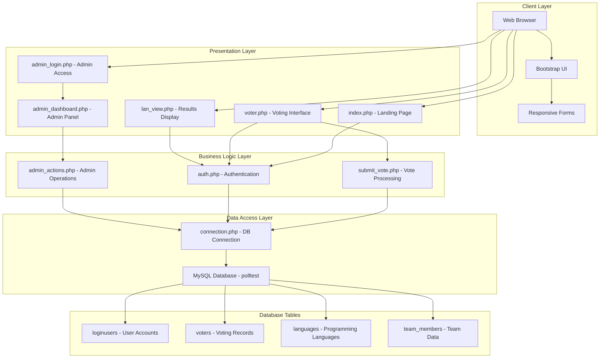

# Security Design Document - Online Voting System

## Overview

This document outlines the security design for the Online Voting System developed by Himanshu Kumar. The system is a web-based voting platform built with PHP, MySQL, and Bootstrap that enables users to vote for programming languages and team members. The design focuses on implementing robust security measures while maintaining usability and performance.

## Architecture

### System Architecture Diagram



### Security Architecture

The security architecture implements multiple layers of protection:

1. **Authentication Layer**: Session-based authentication with PHP sessions
2. **Authorization Layer**: Role-based access control for admin and voter functions
3. **Data Protection Layer**: Input sanitization and SQL injection prevention
4. **Presentation Security**: XSS prevention and secure output rendering
5. **Database Security**: Secure connection management and data integrity

## Components and Interfaces

### 1. Authentication Component

**Purpose**: Manages user authentication and session security

**Key Files**:
- `auth.php`: Session validation middleware
- `admin_login.php`: Administrative authentication interface

**Security Features**:
- PHP session management with `$_SESSION['SESS_NAME']`
- Admin credential validation (username: admin, password: himanshu123)
- Automatic redirection for unauthorized access
- Session-based access control

**Interfaces**:
```php
// Session validation interface
function validateSession() {
    if (!isset($_SESSION['SESS_NAME'])) {
        header("Location: login.php");
        exit();
    }
}

// Admin authentication interface
function authenticateAdmin($username, $password) {
    if ($username === 'admin' && $password === 'himanshu123') {
        $_SESSION['ADMIN_LOGGED_IN'] = true;
        $_SESSION['ADMIN_NAME'] = 'Himanshu Kumar';
        return true;
    }
    return false;
}
```

### 2. Vote Processing Component

**Purpose**: Handles secure vote submission and duplicate prevention

**Key Files**:
- `submit_vote.php`: Core vote processing logic
- `voter.php`: Voting interface

**Security Features**:
- Duplicate vote prevention using database status checks
- Input sanitization with `addslashes()` and `mysqli_real_escape_string()`
- Atomic database transactions for vote integrity
- Separate handling of language and team member votes

**Interfaces**:
```php
// Vote validation interface
function validateVoteSubmission($languageVote, $teamVote) {
    return !empty($languageVote) || !empty($teamVote);
}

// Duplicate vote check interface
function checkVotingStatus($username) {
    $sql = mysqli_query($con, 'SELECT * FROM voters WHERE username="' . $username . '" AND status="VOTED"');
    return mysqli_num_rows($sql) > 0;
}
```

### 3. Admin Management Component

**Purpose**: Provides secure administrative functionality

**Key Files**:
- `admin_dashboard.php`: Administrative interface
- `admin_database.php`: Database management
- `admin_actions.php`: Administrative operations

**Security Features**:
- Role-based access control for admin functions
- Comprehensive system monitoring and statistics
- Secure data manipulation with proper validation
- Audit trail for administrative actions

### 4. Database Access Component

**Purpose**: Manages secure database connections and operations

**Key Files**:
- `connection.php`: Database connection management

**Security Features**:
- Centralized database connection management
- Error handling with `mysqli_error()`
- Prepared statement support for secure queries
- Connection parameter security

## Data Models

### User Authentication Model

```sql
-- loginusers table structure
CREATE TABLE loginusers (
    id INT PRIMARY KEY AUTO_INCREMENT,
    username VARCHAR(50) UNIQUE NOT NULL,
    password VARCHAR(255) NOT NULL,
    rank VARCHAR(20) DEFAULT 'voter',
    status VARCHAR(20) DEFAULT 'ACTIVE'
);
```

### Voting Records Model

```sql
-- voters table structure
CREATE TABLE voters (
    id INT PRIMARY KEY AUTO_INCREMENT,
    firstname VARCHAR(50) NOT NULL,
    lastname VARCHAR(50) NOT NULL,
    username VARCHAR(50) UNIQUE NOT NULL,
    status VARCHAR(20) DEFAULT 'NOT_VOTED',
    voted VARCHAR(50) NULL, -- Language vote
    team_voted VARCHAR(50) NULL -- Team member vote
);
```

### Vote Counting Models

```sql
-- languages table structure
CREATE TABLE languages (
    lan_id INT PRIMARY KEY AUTO_INCREMENT,
    fullname VARCHAR(50) NOT NULL,
    about TEXT,
    votecount INT DEFAULT 0
);

-- team_members table structure
CREATE TABLE team_members (
    member_id INT PRIMARY KEY AUTO_INCREMENT,
    fullname VARCHAR(50) NOT NULL,
    about TEXT,
    votecount INT DEFAULT 0
);
```

## Error Handling

### Database Error Management

**Strategy**: Comprehensive error handling with user-friendly messages

**Implementation**:
```php
// Database connection error handling
$con = mysqli_connect("localhost","root","","polltest") 
    or die ("Database connection error: " . mysqli_error($con));

// Query error handling
if (!$sql1) {
    die("Vote processing error: " . mysqli_error($con));
}
```

### Input Validation Errors

**Strategy**: Validate all user inputs and provide clear feedback

**Implementation**:
```php
// Vote validation
if (empty($_POST['lan']) && empty($_POST['team'])) {
    $error = "<center><h4><font color='#FF0000'>Please select at least one option to vote!</h4></center></font>";
    include "voter.php";
    exit();
}
```

### Authentication Errors

**Strategy**: Secure error messages that don't reveal system information

**Implementation**:
```php
// Admin authentication error
if ($username !== 'admin' || $password !== 'himanshu123') {
    echo '<div class="alert alert-danger text-center">❌ Invalid admin credentials!</div>';
}
```

## Testing Strategy

### Security Testing Approach

1. **Authentication Testing**
   - Test session management and timeout
   - Verify admin credential validation
   - Test unauthorized access prevention

2. **Input Validation Testing**
   - SQL injection prevention testing
   - XSS vulnerability testing
   - Form validation testing

3. **Authorization Testing**
   - Role-based access control testing
   - Admin function protection testing
   - Voter privilege limitation testing

4. **Data Integrity Testing**
   - Vote counting accuracy testing
   - Duplicate vote prevention testing
   - Database transaction integrity testing

### Test Cases

#### Authentication Security Tests

```php
// Test Case 1: Session validation
function testSessionValidation() {
    // Test unauthorized access to voter.php
    unset($_SESSION['SESS_NAME']);
    // Expected: Redirect to login.php
}

// Test Case 2: Admin authentication
function testAdminAuthentication() {
    // Test invalid admin credentials
    $result = authenticateAdmin('wrong', 'credentials');
    // Expected: false
}
```

#### Input Validation Tests

```php
// Test Case 3: SQL injection prevention
function testSQLInjection() {
    $_POST['lan'] = "'; DROP TABLE languages; --";
    // Expected: Input sanitized, no database damage
}

// Test Case 4: Vote validation
function testVoteValidation() {
    $_POST['lan'] = '';
    $_POST['team'] = '';
    // Expected: Error message displayed
}
```

#### Vote Processing Tests

```php
// Test Case 5: Duplicate vote prevention
function testDuplicateVotePrevention() {
    // Set voter status to VOTED
    // Attempt to vote again
    // Expected: Duplicate vote message
}

// Test Case 6: Vote counting accuracy
function testVoteCountingAccuracy() {
    $initialCount = getLanguageVoteCount('JAVA');
    submitVote('JAVA', 'Himanshu');
    $finalCount = getLanguageVoteCount('JAVA');
    // Expected: finalCount = initialCount + 1
}
```

### Security Monitoring and Logging

**Logging Strategy**:
- Authentication attempts (successful and failed)
- Vote submissions with timestamps
- Admin actions and system changes
- Database errors and security events

**Implementation**:
```php
// Security event logging
function logSecurityEvent($event, $details) {
    $timestamp = date('Y-m-d H:i:s');
    $logEntry = "[$timestamp] $event: $details\n";
    file_put_contents('security.log', $logEntry, FILE_APPEND);
}
```

### Performance and Security Optimization

1. **Database Optimization**
   - Indexed columns for faster queries
   - Connection pooling for better performance
   - Query optimization for vote counting

2. **Session Security**
   - Secure session configuration
   - Session timeout implementation
   - Session hijacking prevention

3. **Frontend Security**
   - Content Security Policy implementation
   - XSS prevention in templates
   - Secure form handling

4. **Infrastructure Security**
   - HTTPS enforcement
   - Secure server configuration
   - Regular security updates

This design provides a comprehensive security framework for the Online Voting System while maintaining the existing functionality and user experience.